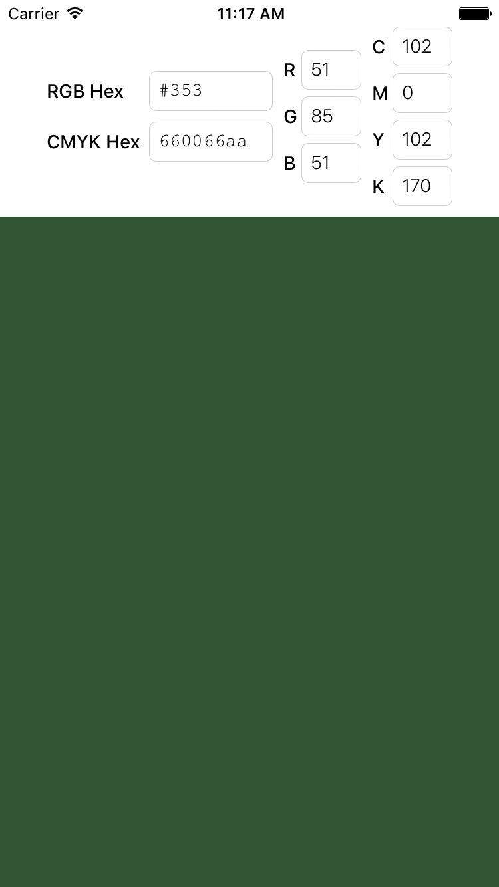

# TFTColor
A simple UIColor library to get UIColor object from RGB hex string/value, CMYK hex string/value or CMYK base component values. 
You can also retrieve back RGB hex string/value, CMYK hex string/value.

[![Awesome iOS][awesome-ios-image]][awesome-ios-url]
[![Swift Version][swift-image]][swift-url]
[![Objective C][objc-image]][objc-url]
[![License][license-image]][license-url]



## Features

- [x] Convert RGB Hex String/Value to UIColor
- [x] Convert CMYK Hex String/Value to UIColor
- [x] Get RGB Hex String/Value from UIColor
- [x] Get CMYK Hex String/Value from UIColor
- [x] Initialize CMYK from its base components


* The beautiful part of this library is that you can input Hex values with `#`, `0x` or `0X` and the it will take care of this.
* Also you can input hex value of any length and this will be handled.
* The library also takes care of non-hex characters.

#### Supporting Formats for RGB Hex Strings:
1. **#B**
2. **#BB**
3. **#RGB**
4. **#GGBB**
5. **#RGGBB**
6. **#RRGGBB** 

#### Supporting Formats for CMYK Hex Strings:
1. **#K**
2. **#KK**
3. **#YKK**
4. **#CMYK**
5. **#MYYKK**
6. **#MMYYKK**
7. **#CMMYYKK**
8. **#CCMMYYKK**

## Requirements

- iOS 8.0+
- Xcode 7.3+

## Installation

#### Manually
**Swift**

1. Download and drop ```TFTColor.swift``` in your project.  

**Objective-C**

1. Download and drop ```TFTColor.h``` & ```TFTColor.m``` in your project. 
2. Congratulations! 


## Usage example
**Swift**

```swift
// UIColor from RGB Hex String
UIColor(rgbHexString: "FF34AE", alpha: 1.0)
UIColor(rgbHexString: "#ea", alpha: 1.0)

// UIColor from RGB Hex Value
UIColor(rgbHexValue: 0xFF34AE alpha: 1.0)

// RGB Hex String from UIColor
let redColor = UIColor.redColor
redColor.rgbHexString //"FF0000"

// RGB Hex Value from UIColor
redColor.rgbHexValue //0xFF0000

// UIColor from CMYK component values 
// Creates and returns a color object using the specified opacity and CMYK component values.
// The components of the color object, specified as a value from 0.0 to 1.0.
UIColor(cyan:0.5, magenta: 0.5, yellow: 0.5, black: 0.5, alpha: 1.0)

// UIColor from CMYK Hex String
UIColor(cmykHexString: "FF34AE34", alpha:1.0)
UIColor(cmykHexString: "#ea", alpha:1.0)

// UIColor from CMYK Hex Value
UIColor(cmykHexValue: 0xFF34AE34 alpha:1.0f)

// CMYK Hex String from UIColor
redColor.cmykHexString //"00646400"

// CMYK Hex Value from UIColor
redColor.cmykHexValue //0x00646400
``` 

**Objective-C**

```objc
// UIColor from RGB Hex String
[UIColor colorWithRGBHexString:@"FF34AE" alpha:1.0f];
[UIColor colorWithRGBHexString:@"#ea" alpha:1.0f];

// UIColor from RGB Hex Value
[UIColor colorWithRGBHexValue:0xFF34AE alpha:1.0f];
 
// RGB Hex String from UIColor
[UIColor rgbHexStringForColor:[UIColor redColor]]; //@"FF0000"
 
// RGB Hex Value from UIColor
[UIColor rgbHexValueForColor:[UIColor redColor]]; //0xFF0000

// UIColor from CMYK component values
// Creates and returns a color object using the specified opacity and CMYK component values.
// The components of the color object, specified as a value from 0.0 to 1.0.
[UIColor colorWithCyan:0.5f magenta:0.5 yellow:0.5f black:0.5f alpha:1.0f];

// UIColor from CMYK Hex String
[UIColor colorWithCMYKHexString:@"FF34AE34" alpha:1.0f];
[UIColor colorWithCMYKHexString:@"#EA" alpha:1.0f]; 

// UIColor from CMYK Hex Value
[UIColor colorWithCMYKHexValue:0xFF34AE34 alpha:1.0f];

// CMYK Hex String from UIColor
[UIColor cmykHexStringForColor:[UIColor redColor]]; //"00646400" 

// CMYK Hex Value from UIColor
[UIColor cmykHexValueForColor:[UIColor redColor]]; //0x00646400
``` 

## Contribute

We would love for you to contribute to **TFTColor**, check the ``LICENSE`` file for more info.

## Meta

Burhanuddin Sunelwala – [@burhanuddin353](https://twitter.com/burhanuddin353) – burhanuddin353@gmail.com

Distributed under the **The MIT License (MIT)** license. See ``LICENSE`` for more information.

[https://github.com/burhanuddin353/TFTColor](https://github.com/burhanuddin353/TFTColor)

[swift-image]: https://img.shields.io/badge/swift-3.0-orange.svg
[swift-url]: https://swift.org/
[objc-image]: https://img.shields.io/badge/Objective-C-purple.svg
[objc-url]: https://developer.apple.com/library/ios/documentation/Cocoa/Conceptual/ProgrammingWithObjectiveC/Introduction/Introduction.html
[license-image]: https://img.shields.io/badge/License-MIT-blue.svg
[license-url]: https://github.com/burhanuddin353/TFTColor/blob/master/LICENSE
[travis-image]: https://img.shields.io/travis/dbader/node-datadog-metrics/master.svg?style=flat-square
[travis-url]: https://travis-ci.org/dbader/node-datadog-metrics
[codebeat-image]: https://codebeat.co/badges/c19b47ea-2f9d-45df-8458-b2d952fe9dad
[codebeat-url]: https://codebeat.co/projects/github-com-vsouza-awesomeios-com
[awesome-ios-image]: https://img.shields.io/badge/Awesome-iOS-blue.svg
[awesome-ios-url]: https://github.com/vsouza/awesome-ios